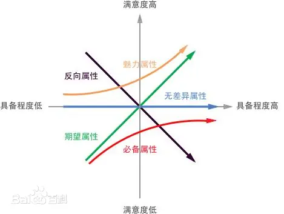

## 功能优先级划分和 Kano 模型

Kano 模型的核心洞察在于：**用户满意度与功能实现程度之间，并不是简单的线性关系（即不是功能做得越多越好）。**

**Kano 模型**，就是解决“手里资源有限，到底先做哪个功能”这一千古难题的利器。

### 🧩 Kano 模型的核心逻辑：五类需求

狩野纪昭教授将用户需求分为五类。理解这五类需求，是进行优先级排序的基础。我们可以把它们想象成打怪升级的不同装备：

| 需求类型 | 核心特征 | 用户心理 | 优先级策略 |
| :--- | :--- | :--- | :--- |
| **1. 基本型需求**(Must-be) | **门槛** | “这是你应该有的。”有了无感，没有会骂死。 | **P0 (最高)**必须优先满足，否则产品不可用。 |
| **2. 期望型需求**(One-dimensional) | **竞争** | “越多越好。”有了开心，没有失望。 | **P1 (高)**投入产出比最稳定，是竞争的主战场。 |
| **3. 兴奋型需求**(Attractive) | **惊喜** | “哇，居然还有这个！”有了惊喜，没有无所谓。 | **P2 (中/高)**低成本高回报，用于差异化突围。 |
| **4. 无差异型需求**(Indifferent) | **鸡肋** | “有没有都无所谓。” | **P3 (低)**坚决砍掉或延后，避免资源浪费。 |
| **5. 反向型需求**(Reverse) | **累赘** | “别给我整这个，烦人。”有了反而不满。 | **负分**坚决不做。 |

#### 1. 基本型需求 (Must-be Quality) —— “理所当然”
这是产品的**“保健因素”**。
*   **例子**：手机的打电话功能、微信的发消息功能、酒店的干净床单。
*   **分析**：如果你的手机不能打电话，屏幕再漂亮你也会把它摔了。但手机能打电话，你并不会因此感动得痛哭流涕，因为你觉得这是理所当然的。
*   **策略**：做到“及格”即可，不要过度投入，因为投入再多也换不来满意度的提升。

#### 2. 期望型需求 (One-dimensional Quality) —— “多多益善”
这是产品的**“性能因素”**，也是线性关系最明显的区域。
*   **例子**：电动车的续航里程、APP 的加载速度、视频网站的画质。
*   **分析**：续航从 200km 提升到 500km，你的满意度会直线飙升；反之，如果加载一个页面要 10 秒，你会非常不爽。
*   **策略**：这是竞品比拼的主战场。在资源允许的情况下，尽可能做得比对手好。

#### 3. 兴奋型需求 (Attractive Quality) —— “眼前一亮”
这是产品的**“魅力因素”**，也是产生“哇塞时刻”的来源。
*   **例子**：海底捞等位时的美甲服务、微信刚出时的“摇一摇”、早期的指纹解锁。
*   **分析**：用户根本没指望酒店提供美甲，结果提供了，满意度瞬间爆表。但如果酒店不提供美甲，用户也不会投诉，因为本来就没期待。
*   **策略**：这是产品经理展现创造力的地方。用较小的成本创造惊喜，是产品突围的关键。

#### 4. 无差异型需求 (Indifferent Quality) —— “关我屁事”
*   **例子**：APP 设置里一个极其冷门的参数、后台从未被点击的统计功能。
*   **分析**：用户根本不在乎。
*   **策略**：**砍掉！** 很多产品经理容易陷入自嗨，做了很多用户不关心的功能，这就是资源浪费。

#### 5. 反向型需求 (Reverse Quality) —— “画蛇添足”
*   **例子**：强制用户观看的开机广告、复杂的注册流程、过多的弹窗。
*   **分析**：你做得越“好”（比如广告做得越精美），用户越反感。
*   **策略**：坚决避免。

---

### 🛠️ 如何落地：Kano 问卷与分析

作为产品经理，我们怎么知道一个功能属于哪一类呢？不能靠猜，要靠**Kano 问卷**。

对于每一个功能，我们要问用户两个问题（一正一反）：

1.  **正向问题**：如果产品具备这个功能，你感觉如何？
2.  **反向问题**：如果产品不具备这个功能，你感觉如何？

**选项通常是：** 喜欢、理应如此、无所谓、能忍受、不喜欢。

**分析逻辑（举例）：**
*   如果用户对“正向”选“喜欢”，对“反向”选“不喜欢” → **期望型需求**（线性）。
*   如果用户对“正向”选“理应如此”，对“反向”选“不喜欢” → **基本型需求**（必须有）。
*   如果用户对“正向”选“喜欢”，对“反向”选“无所谓” → **兴奋型需求**（惊喜）。

---

### 🚀 实战策略：如何排优先级？

拿到分类结果后，我们的资源分配策略通常遵循以下顺序：

1.  **第一梯队：基本型需求 (Must-be)**
    *   **原则**：**先活下来。** 必须首先满足，这是入场券。如果基本功能有缺陷，做再多花哨的功能也是零分。
    *   *注意：* 只要做到“达标”即可，不要追求完美，边际效益递减。

2.  **第二梯队：期望型需求 (One-dimensional)**
    *   **原则**：**建立优势。** 在满足基本需求后，将主要资源投入到这里。这是用户感知最强、最愿意为此付费的地方。

3.  **第三梯队：兴奋型需求 (Attractive)**
    *   **原则**：**制造尖叫。** 挑选 1-2 个低成本、高感知的兴奋点作为“杀手锏”。
    *   *警惕：* 兴奋型需求具有**时效性**。今天的兴奋点（如当年的指纹解锁），明天就会变成基本点。

4.  **坚决砍掉：无差异 & 反向需求**
    *   **原则**：**做减法。** 把省下来的资源投入到前两类需求中。

### 💡 资深 PM 的“避坑”指南

在使用 Kano 模型时，有几个经验之谈分享给你：

*   **需求是流动的**：
    不要刻舟求剑。随着时间推移，**兴奋型 → 期望型 → 基本型** 是必然规律。以前送免费贴膜是兴奋点，现在手机出厂带膜是基本点。你需要定期重新调研。
*   **不要过度追求基本型**：
    很多 PM 容易犯的错误是，把一个基本功能（比如登录页面）做得美轮美奂、动画酷炫，但这并不能提升用户满意度，因为用户只想要“快点登进去”。**基本功能，稳和快最重要。**
*   **结合 Y 模型使用**：
    用 Y 模型挖掘出用户的人性需求后，用 Kano 模型来判断这个需求在当前阶段属于哪一类，从而决定开发的优先级。

希望这个讲解能帮你更好地运用 Kano 模型，在资源有限的情况下，做出让用户最满意的产品！如果有具体的案例想分析，随时发给我。
